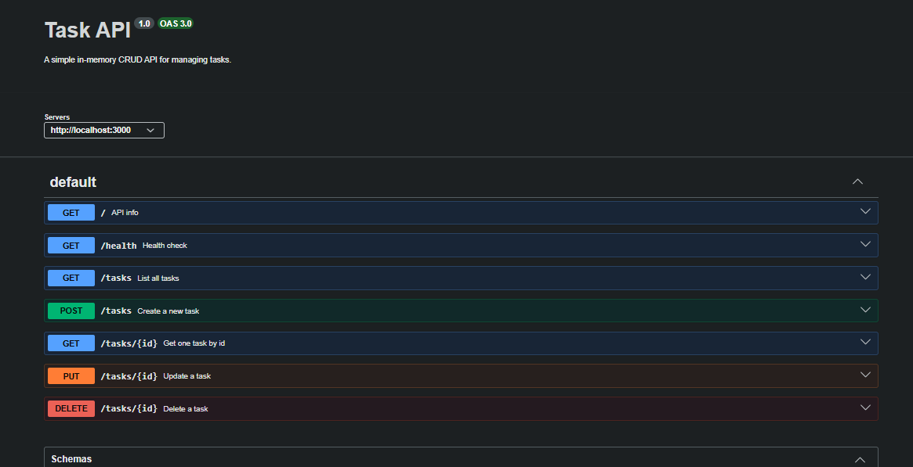

# Task API

A simple in-memory CRUD API for managing tasks, built with **Node.js** and **Express**. It supports creating, reading, updating, and deleting tasks, with interactive documentation served via **Swagger UI** at `/docs`.

No database is used — tasks are stored in memory and reset every time the server restarts.

---

## Install & Run

From the project root:

```bash
cd Flyrank-CRUD && npm install && npm run server
```

The server starts on **http://localhost:3000**.

- API root: http://localhost:3000/
- Health check: http://localhost:3000/health
- Swagger UI: http://localhost:3000/docs

> Make sure your `package.json` has a `server` script, e.g.:
> ```json
> "scripts": {
>   "server": "node server.js"
> }
> ```

---

## Endpoints

| Method | Path            | Description                              | Status Codes              |
|--------|-----------------|------------------------------------------|---------------------------|
| GET    | `/`             | API metadata (name, version, endpoints)  | 200                       |
| GET    | `/health`       | Server health check                      | 200                       |
| GET    | `/tasks`        | List all tasks                           | 200                       |
| GET    | `/tasks/:id`    | Get a single task by id                  | 200, 404                  |
| POST   | `/tasks`        | Create a new task                        | 201, 400                  |
| PUT    | `/tasks/:id`    | Update a task's `title` and/or `done`    | 200, 400, 404             |
| DELETE | `/tasks/:id`    | Delete a task                            | 200/204, 404              |

All error responses return JSON, e.g. `{ "statusCode": 404, "message": "Task 99 not found", "success": false }`.

---

## Example: `curl -i` output

Request:

```bash
curl -i http://localhost:3000/tasks/1
```

Response:

```
HTTP/1.1 200 OK
X-Powered-By: Express
Content-Type: application/json; charset=utf-8
Content-Length: 96
ETag: W/"60-n0Xk9i1n0d/4y8bQhZ0kP"
Date: Mon, 21 Sep 2026 10:15:42 GMT
Connection: keep-alive
Keep-Alive: timeout=5

{"statusCode":200,"data":{"id":1,"title":"Buy milk","done":false},"message":"Success","success":true}
```

And for a missing id:

```bash
curl -i http://localhost:3000/tasks/99
```

```
HTTP/1.1 404 Not Found
X-Powered-By: Express
Content-Type: application/json; charset=utf-8
Content-Length: 78
Date: Mon, 21 Sep 2026 10:15:50 GMT
Connection: keep-alive
Keep-Alive: timeout=5

{"statusCode":404,"message":"Task 99 not found","success":false}
```

---

## Swagger UI

Interactive documentation is available at **http://localhost:3000/docs**. Every endpoint is listed, and the **Try it out** button lets you run the full CRUD cycle without curl.



> Save your screenshot as `docs-screenshot.png` in the repo root so this image renders on GitHub.

---

## Project Structure

```
Flyrank-CRUD/
├── server.js
├── openapi.json
├── package.json
├── docs-screenshot.png
└── Utils/
    ├── apiError.js
    ├── apiResponse.js
    └── asyncHandler.js
```

---

## Notes

- Tasks are stored **in memory** — restarting the server resets them to the 10 seed tasks in `server.js`.
- The API validates `POST` and `PUT` bodies; missing/empty `title` returns `400`.

